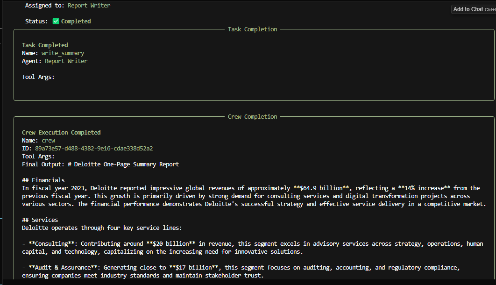
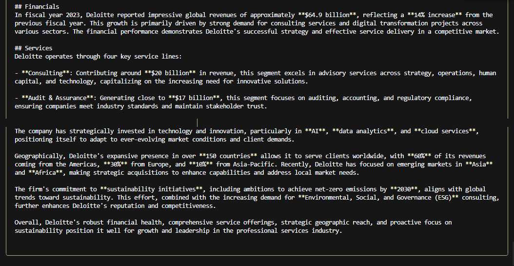

# Junior Business Analyst Crewai

This project demonstrates how AI agents can support **business analyst workflows** for consulting firms such as Deloitte, EY, KPMG, and PwC.  
It uses [CrewAI](https://www.crewai.com/) to coordinate agents that generate **one-page company reports** with financials, services, market opportunities, and 2025 insights.

---

## 🚀 Features
- **Company Insights Agent**: Collects structured data points on a target consulting firm.  
- **Report Writer Agent**: Produces a one-page report highlighting growth drivers, differentiators, and opportunities.  
- Outputs reports in Markdown format for easy sharing (e.g., `output/Deloitte_report.md`).  

---

## 📂 Project Structure
- config/agents.yaml # Agent configs
- config/tasks.yaml # Task configs
- src/business_analyst/crew.py # Crew setup
- src/business_analyst/main.py # Run script
- output/ # Generated reports

## 📊 Example of the Report Generated

Here is an example of a Deloitte one-page analyst brief generated by the project:

Task Process

Report

  

